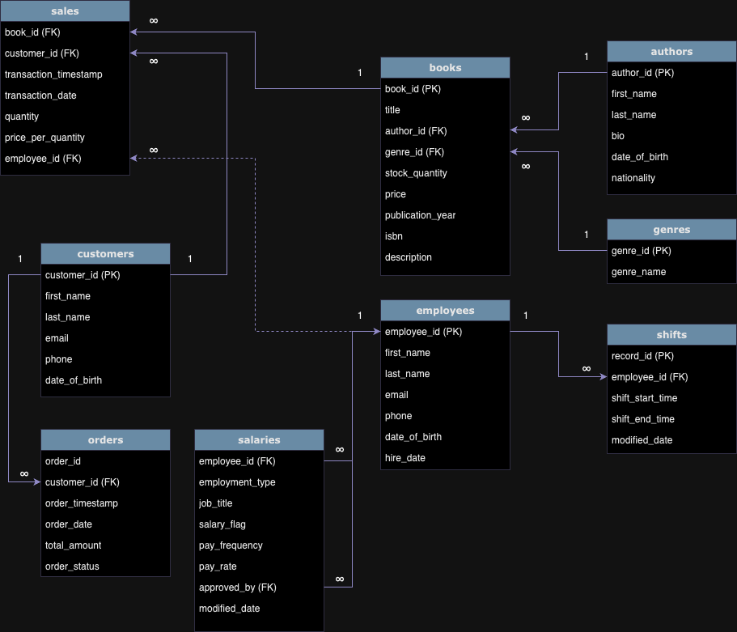

# Assignment 1: Design a Logical Model

## Question 1
Create a logical model for a small bookstore. 📚

At the minimum it should have employee, order, sales, customer, and book entities (tables). Determine sensible column and table design based on what you know about these concepts. Keep it simple, but work out sensible relationships to keep tables reasonably sized. Include a date table. There are several tools online you can use, I'd recommend [_Draw.io_](https://www.drawio.com/) or [_LucidChart_](https://www.lucidchart.com/pages/).
```
See the diagram embedded below:
```


## Question 2
We want to create employee shifts, splitting up the day into morning and evening. Add this to the ERD.

Please see the ERD embedded above. There is a separate 'shifts' table.


## Question 3
The store wants to keep customer addresses. Propose two architectures for the CUSTOMER_ADDRESS table, one that will retain changes, and another that will overwrite. Which is type 1, which is type 2?

_Hint, search type 1 vs type 2 slowly changing dimensions._

Bonus: Are there privacy implications to this, why or why not?
```
In the SCD context, there are two commonly used architectures: Type 1 and Type 2.

Type 1 - Retain Changes
In a Type 1 architecture, changes to the customer address are not tracked. The table is updated directly with the new address information,
and the old address is overwritten. This approach is simple and efficient but does not retain historical information about address changes.
With this architecture, when a customer updates their address, the existing record in the table is simply replaced with the new address information.

In a Type 2 architecture, changes to the customer address are tracked by creating new records in the table. Each record includes a timestamp or
version number to indicate when the change occurred. This approach retains a history of address changes over time but can result in a larger database size.
With this architecture, when a customer updates their address, a new record is inserted into the table with the updated address information and effective date.
The expiration date of the previous address record can be set to indicate when it is no longer valid.

From a privacy standpoint, both types can have some implications.

In Type 1, old address information is overwritten, so there is no historical record of changes. This means that if there is a need to audit or track
changes for any reason, that information is lost. However, from a privacy perspective, this approach may be preferable because it ensures that outdated
address information is not retained in the database.

In Type 2, historical address information is retained, which provides a complete audit trail of address changes over time. While this can be useful
for analysis and auditing purposes, it also means that old address information is stored indefinitely in the database, potentially increasing privacy
risks if the database is compromised.

Ultimately, the choice between Type 1 and Type 2 architectures depends on factors such as regulatory requirements, data retention policies, and the
balance between data utility and privacy concerns.

```

## Question 4
Review the AdventureWorks Schema [here](https://i.stack.imgur.com/LMu4W.gif)

Highlight at least two differences between it and your ERD. Would you change anything in yours?
```
I'd certainly make quite a few changes to mine :)

The first main difference lies in the level of detalization. The AdventureWorks Schema is quite extensive. The model is visually broken down by business
function, allowing for the recording and tracking of a wide variety of data, considering the business context and its future usage.

The second notable difference is that each table has a ModifiedDate column, enabling the monitoring of amendments made to data in each table.
Referring to Question 3 above, I'd assume that it may be the case that the SCD Type 2 is being utilized across the entire database to track historical data.

The third distinctive difference is the presence of a database owner table in the schema, which stores database logs and technical details.

```

# Criteria

[Assignment Rubric](./assignment_rubric.md)

# Submission Information

🚨 **Please review our [Assignment Submission Guide](https://github.com/UofT-DSI/onboarding/blob/main/onboarding_documents/submissions.md)** 🚨 for detailed instructions on how to format, branch, and submit your work. Following these guidelines is crucial for your submissions to be evaluated correctly.

### Submission Parameters:
* Submission Due Date: `June 1, 2024`
* The branch name for your repo should be: `model-design`
* What to submit for this assignment:
    * This markdown (design_a_logical_model.md) should be populated.
    * Two Entity-Relationship Diagrams (preferably in a pdf, jpeg, png format).
* What the pull request link should look like for this assignment: `https://github.com/<your_github_username>/sql/pull/<pr_id>`
    * Open a private window in your browser. Copy and paste the link to your pull request into the address bar. Make sure you can see your pull request properly. This helps the technical facilitator and learning support staff review your submission easily.

Checklist:
- [X] Create a branch called `model-design`.
- [X] Ensure that the repository is public.
- [X] Review [the PR description guidelines](https://github.com/UofT-DSI/onboarding/blob/main/onboarding_documents/submissions.md#guidelines-for-pull-request-descriptions) and adhere to them.
- [X] Verify that the link is accessible in a private browser window.

If you encounter any difficulties or have questions, please don't hesitate to reach out to our team via our Slack at `#cohort-3-help`. Our Technical Facilitators and Learning Support staff are here to help you navigate any challenges.
